# 🌌 **AstroBot**

**AstroBot** is a **conversational astrology assistant** powered by AI and designed for seamless scalability.
It runs as a **Telegram bot** that communicates through **Azure Event Hub** and **Redis**, enabling async, distributed processing of astrology-related queries.

---

## ✨ **Features**

* 🔮 Conversational astrology responses with **contextual memory**
* ⚡ Asynchronous **task queuing** via **Azure Event Hub**
* 🧠 Redis-backed **task state** and **conversation history**
* 🧩 Modular architecture with separate **worker process** for scalability
* 💬 Integrated with **OpenRouter** for LLM-powered astrology readings

---

## ⚙️ **Architecture Overview**

AstroBot consists of three main components:

| Component                   | Description                                                                                   |
| --------------------------- | --------------------------------------------------------------------------------------------- |
| **Telegram Bot (`app.py`)** | Receives user messages, enqueues them into Event Hub, and monitors Redis for completion.      |
| **Worker (`consumer.py`)**  | Listens to Event Hub for pending tasks, processes them using the LLM, and sends results back. |
| **Redis**                   | Stores pending/completed task states and user conversation history.                           |

---

## 🧭 **Flow Diagram**

```mermaid
sequenceDiagram
    participant User as 🧑 User (Telegram)
    participant Bot as 🤖 AstroBot (Telegram Bot)
    participant EH as ☁️ Azure Event Hub
    participant Redis as 🧠 Redis
    participant Worker as ⚙️ Worker (LLM Processor)
    participant LLM as 🔮 LLM API (OpenRouter)

    User->>Bot: Sends astrology question
    Bot->>Redis: Save task as "pending"
    Bot->>EH: Publish task message
    Bot-->>User: "Thinking about your question..."
    
    EH->>Worker: Deliver task event
    Worker->>Redis: Check if task is pending
    Worker->>LLM: Generate astrology response
    LLM-->>Worker: Return response
    Worker->>Redis: Update task as "completed"
    Worker->>EH: Publish result event
    
    EH->>Bot: Deliver result event
    Bot->>Redis: Store completed result
    Bot-->>User: Sends astrology reply ✨
```



---

## 🧩 **Requirements**

* Python **3.11+**
* Works on **Windows/macOS/Linux**
* **Redis** instance (local or cloud)
* **Azure Event Hub** namespace and event hub
* **Telegram Bot Token**
* **OpenRouter API Key** (for AI-based astrology responses)

---

## 🚀 **Installation**

1. **Clone the repository:**

   ```bash
   git clone https://github.com/yourusername/astrobot.git
   cd astrobot
   ```

2. **Set up a virtual environment:**

   ```powershell
   python -m venv env
   env\Scripts\Activate.ps1    # On Windows
   # OR
   source env/bin/activate     # On macOS/Linux
   ```

3. **Install dependencies:**

   ```bash
   pip install -r requirements.txt
   ```

---

## 🔧 **Configuration**

Copy the example environment file and set your own values:

```bash
cp example.env .env
```

### Required Environment Variables

| Variable             | Description                                   |
| -------------------- | --------------------------------------------- |
| `TELEGRAM_BOT_TOKEN` | Telegram Bot API token                        |
| `OPENROUTER_API_KEY` | API key for LLM provider (e.g., OpenRouter)   |
| `DEFAULT_LLM_MODEL`  | Default LLM model to use                      |
| `REDIS_URL`          | Redis connection string (`redis://host:port`) |
| `CONNECTION_STR`     | Azure Event Hub connection string             |
| `EVENT_HUB_NAME`     | Event Hub name                                |

> ⚠️ **Never commit `.env` or secrets** to version control.

---

## 💬 **Conversational Flow Example**

**User:**

> "What does my day look like for Leo?"

**AstroBot:**

> "✨ The stars encourage you to trust your instincts today, Leo!
> Focus on communication and balance—especially in relationships.
> A small decision could lead to a meaningful opportunity. 🌟"

---

## ▶️ **Running the Bot**

Start the Telegram bot that listens to user messages and enqueues tasks:

```bash
python app.py
```

The bot will:

* Accept user messages
* Create a task and store it in Redis
* Publish it to Event Hub for the worker to process

---

## ⚙️ **Running the Worker**

The worker consumes events from Event Hub, generates responses using the LLM, and pushes results back:

```bash
python consumer.py
```

The worker runs asynchronously and can be deployed separately (for example, on Azure, AWS, or any VM).

---

## 🧰 **Development Notes**

* **Logging:** Configured in `src/utils/logger.py`
* **Redis Client:** `src/utils/redis_client.py`
* **Event Hub Helpers:** `src/utils/eventhub_utils.py`
* **Conversational Engine:** `src/utils/language_model.py`

---

## 🩺 **Troubleshooting**

| Issue                  | Possible Cause               | Fix                                           |
| ---------------------- | ---------------------------- | --------------------------------------------- |
| Bot not starting       | Missing `TELEGRAM_BOT_TOKEN` | Check `.env`                                  |
| Redis connection error | Invalid `REDIS_URL`          | Ensure Redis is running and accessible        |
| Event Hub errors       | Wrong connection string      | Check `CONNECTION_STR` and `EVENT_HUB_NAME`   |
| No response            | LLM timeout or API error     | Check `OPENROUTER_API_KEY` and network access |

> 🪄 Use `redis-cli` to inspect keys like `task:<correlation_id>` for debugging.

---

## 🔐 **Security Tips**

* Keep all API keys in environment variables (not in code)
* Use `.env` for local dev only — secrets should be managed securely
* Use HTTPS endpoints for all API communication

---

## 🤝 **Contributing**

Pull requests are welcome!
Please open an issue first to discuss what you’d like to change or improve.

---

## 📜 **License**

**MIT License** — see the [`LICENSE`](LICENSE) file for details.
